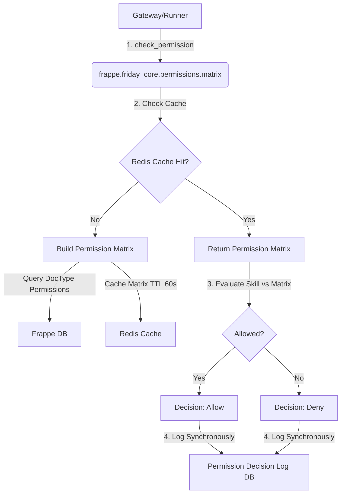

# Proposal: Slice 2 — Permission Engine

## Status
- **Author:** `fridaylabs` (L0 Visitor)
- **Sponsor:** `Fridaylabsinc`
- **Created At:** 2026-05-27
- **Status:** Draft

---

## 1. Problem & Context

Both Hermes and OpenClaw historically suffered from privilege escalation, memory poisoning, and prompt injection attacks due to treating security as configuration rather than architecture. 

In Friday, security is built directly into the core layers. The **Permission Engine** is a synchronous gateway-level component designed to validate whether a given `Agent Profile` is authorized to execute a requested `Skill` *before* the skill is queued or run in the sandboxed Docker worker.

This proposal specifies the design and implementation of vertical Slice 2.

---

## 2. Proposed Changes & Architecture

The Permission Engine will live inside the framework under `frappe/friday_core/permissions/`.



### 2.1 Matrix Module (`frappe/friday_core/permissions/matrix.py`)

This module implements permission evaluation and matrix construction.

#### Types & Structures
```python
from typing import TypedDict, Literal

class Decision(TypedDict):
    allowed: bool
    reason: str
    decision_log_id: str | None
```

#### Functions

1. **`build_matrix(agent_profile_name: str) -> dict`**
   - Resolves the `Agent Profile` row.
   - Loads the assigned `Role`s mapped to the profile.
   - For each role, queries Frappe's database permission rules (`Custom DocPerm` / `DocPerm`) to construct a mapping of permitted DocTypes and their associated allowed operations (e.g., `read`, `write`, `create`, `delete`, `submit`, `cancel`).
   - Retrieves the explicitly permitted skills table from the `Agent Profile` (if whitelist is defined).
   - Returns a structured dictionary representing the evaluation matrix.

2. **`check(agent_profile_name: str, skill_name: str) -> Decision`**
   - Retrieves the skill metadata for `skill_name`.
   - Validates the skill status: **Must be `Active`**. If status is `Draft`, `Experimental`, `Retired`, or `Archived`, execution is **denied** (with exception for the creator if relevant).
   - Resolves the permission matrix for the profile (utilizing the cache wrapper).
   - Performs subset checks:
     - **DocTypes Check:** `skill.required_doctypes` must be a subset of the profile's permitted DocTypes.
     - **Operations Check:** `skill.required_operations` must be a subset of the profile's allowed operations on those DocTypes.
   - Persists the outcome by calling `log_decision()` synchronously and returns the structured `Decision` dict.

---

### 2.2 Cache Module (`frappe/friday_core/permissions/cache.py`)

Synchronous permission checks must be exceptionally fast (<10ms). We will leverage Redis caching via Frappe's built-in caching engine (`frappe.cache()`).

- **Cache Key:** `friday:perm_matrix:{profile_name}`
- **TTL (Time to Live):** 60 seconds.
- **Cache Invalidation Hooks:**
  - `invalidate_for_profile(doc, method=None)`: Invalidates the cache for a specific `Agent Profile` when it is updated or suspended.
  - `invalidate_all(doc, method=None)`: Invalidates all matrix caches whenever system `Role` or `DocPerm` rules are updated.

---

### 2.3 Decisions Module (`frappe/friday_core/permissions/decisions.py`)

Every permission check outcome is logged synchronously to ensure a tamper-proof audit trail.

- **Target DocType:** `Permission Decision Log` (submittable).
- **Behavior:**
  - Creates a new `Permission Decision Log` document containing:
    - `agent_profile`
    - `skill`
    - `decision` (Allow / Deny / Error)
    - `reason` (e.g., "Missing role with Write permission on Note DocType")
    - `timestamp`
  - Calls `.insert()` followed immediately by `.submit()` to render the row immutable (append-only).

---

### 2.4 Integration and Hooks Configuration (`frappe/friday_core/hooks.py`)

Register the cache invalidation triggers inside the framework's hook configuration:

```python
doc_events = {
    "Agent Profile": {
        "on_update": "frappe.friday_core.permissions.cache.invalidate_for_profile",
        "on_trash": "frappe.friday_core.permissions.cache.invalidate_for_profile"
    },
    "Role": {
        "on_update": "frappe.friday_core.permissions.cache.invalidate_all"
    },
    "DocPerm": {
        "on_update": "frappe.friday_core.permissions.cache.invalidate_all"
    },
    "Custom DocPerm": {
        "on_update": "frappe.friday_core.permissions.cache.invalidate_all"
    }
}
```

---

## 3. Testing & Coverage Plan

We will target **80% line coverage** on `matrix.py` and **100% branch coverage** on `check()`.

### Test Cases Checklist
- `[ ]` **Allow Case:** Profile with roles that grant full access (e.g., `System Manager`) successfully executes active skills requiring standard doctype permissions.
- `[ ]` **Deny Case (Role Missing):** Profile lacking the required database roles is denied.
- `[ ]` **Deny Case (Operation Missing):** Profile has `read` permission on DocType but Skill requires `write` permission. Evaluates to Deny.
- `[ ]` **Status Deny Case:** Skill is in `Draft` or `Retired` state. Evaluates to Deny.
- `[ ]` **Cache Verification:** First check builds matrix and stores it in Redis (cache miss); second check reads directly from Redis (cache hit) within 60 seconds.
- `[ ]` **Cache Invalidation:** Updating an `Agent Profile` or updating a `Role` successfully clears the corresponding Redis key.
- `[ ]` **Audit Logging:** Every check inserts and submits a `Permission Decision Log` row. Assert that the row is indeed submitted and immutable.

---

## 4. Risks & Mitigations

| Risk | Impact | Mitigation |
|---|---|---|
| Latency from synchronous psql logging | Medium | Logging uses fast ORM inserts. If DB writes bottleneck, we can batch log submission using a fast background queue, though synchronous logging is preferred for audit integrity. |
| Stale Cache on fast role modifications | Low | Mapped hooks automatically invalidate active matrix caches. Short TTL of 60s serves as a hard safety fallback. |
