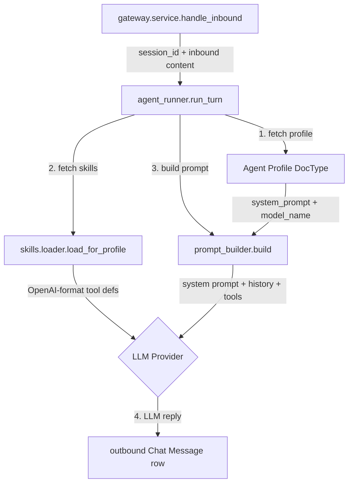

# Proposal: Slice 5 — LLM Integration

## Status
- **Author:** `fridaylabs` (L0 Visitor)
- **Sponsor:** `iamfriday86`
- **Created At:** 2026-05-28
- **Status:** Draft

---

## 1. Problem & Context

Friday Slices 1–4 have established the governed framework loop:

- **Slice 1** gave us the DocType skeleton.
- **Slice 2** gave us a permission engine that returns `(allowed: bool, reason: str)` and logs every decision immutably.
- **Slice 3** gave us a skill loader that produces LLM-ready tool definitions filtered by what the agent is permitted to see.
- **Slice 4** gave us a unified gateway and a CLI that can receive a message and produce an outbound reply — but the reply is currently an echo stub.

The agent is functionally a gatekeeper with a menu it cannot read. **Slice 5 replaces the echo stub with a real LLM call**, completing the minimal demo loop: user types a request → LLM sees the tool menu → LLM replies with context.

This is not yet tool execution (that is Slice 6). This is just the LLM being in the loop with the permission-filtered tool menu as its world model.

---

## 2. Proposed Changes & Architecture

The LLM integration lives inside `frappe/friday_core/llm/`.



### 2.1 Provider Adapter (`frappe/friday_core/llm/provider.py`)

A provider-agnostic interface with Minimax M2 as the Phase 1 implementation.

#### Interface

```python
from abc import ABC, abstractmethod
from typing import TypedDict

class LLMResponse(TypedDict):
    content: str
    finish_reason: str
    usage: dict  # {prompt_tokens, completion_tokens, total_tokens}

class LLMProvider(ABC):
    @abstractmethod
    def chat(
        self,
        messages: list[dict],  # [{role: "system"|"user"|"assistant", content: str}]
        tools: list[dict] | None = None,
        model: str | None = None,
    ) -> LLMResponse: ...

    @abstractmethod
    def get_default_model(self) -> str: ...
```

#### Minimax Adapter

- Inherits `LLMProvider`.
- Reads API key and config from the `LLM Provider` DocType row linked from `Agent Profile.model_provider` (falls back to `Agent Settings.default_provider`).
- Calls Minimax chat completions API (`https://api.minimax.chat/v1/text/chatcompletion_v2`).
- Handles `401` (invalid key → clean error), `429` (rate limit → retry with backoff), `500` (server error → retry up to 3x).
- Timeout: 30 seconds per request.

### 2.2 Prompt Builder (`frappe/friday_core/llm/prompt_builder.py`)

Assembles the full prompt from components already in Frappe.

```python
def build(
    profile_name: str,
    session_id: str,
    inbound_content: str,
    tools: list[dict] | None = None,
    max_history_turns: int = 10,
) -> dict:
    """
    Returns a messages list ready for LLMProvider.chat().
    {
        "messages": [...],
        "tools": [...] | None,
        "model": str,
    }
    """
```

- **System prompt:** `Agent Profile.system_prompt` — static persona set by the operator.
- **History:** last `max_history_turns` Chat Message rows for this `session_id`, direction=outbound, oldest first. Format: `{"role": "user", "content": ...}` for inbound; `{"role": "assistant", "content": ...}` for outbound.
- **Tools:** passed in from `load_for_profile()` caller; `None` if no tools are permitted (agent is query-only).
- **Model:** from `Agent Profile.model_name`, falling back to `Agent Settings` default.

### 2.3 LLM Provider DocType (`frappe/friday_core/doctype/llm_provider/`)

A proper DocType for provider configuration — not a Select field on a singleton. Each row represents one configured provider instance.

| Field | Type | Notes |
|-------|------|-------|
| `provider_name` | Data | Unique — e.g., "Production Minimax", "Dev OpenAI" |
| `provider_type` | Select | minimax / openai / anthropic / openrouter |
| `api_key` | Password | Encrypted at rest |
| `base_url` | Data | Optional override (e.g., OpenRouter proxy). Blank = provider default. |
| `default_model` | Data | Provider's default model if Agent Profile doesn't specify one |
| `default_max_tokens` | Int | Default 2048 |
| `default_temperature` | Float | Default 0.7 |
| `is_active` | Check | Only active providers are usable |

**Singleton `Agent Settings`** continues to hold global defaults (e.g., which provider to use if Agent Profile doesn't specify one) and the `after_migrate` hook that creates the default provider row on first site setup.

`Agent Profile.model_provider` becomes a Link → `LLM Provider` instead of a Select. If the link is empty, fall back to `Agent Settings.default_provider`.

### 2.4 Runner Update (`frappe/friday_core/agent_runner/runner.py`)

Replaces the echo stub in `run_turn()`:

```python
def run_turn(profile_name: str, session_id: str, inbound_content: str) -> str:
    # 1. Load permitted skills (from Slice 3)
    tools = load_for_profile(profile_name)  # list[SkillDefinition]
    
    # 2. Build prompt
    prompt = build(profile_name, session_id, inbound_content, tools)
    
    # 3. Call LLM
    provider = get_provider_for_profile(profile_name)  # reads Agent Profile → Agent Settings
    response = provider.chat(prompt["messages"], tools=prompt["tools"], model=prompt["model"])
    
    return response["content"]
```

Error handling: if LLM call fails after retries, write a system-error outbound Chat Message row with the error reason. Do not crash the gateway.

---

## 3. Files to Create or Modify

| File | Action | Notes |
|------|--------|-------|
| `frappe/friday_core/llm/__init__.py` | Create | Package init + `get_provider_for_profile()` |
| `frappe/friday_core/llm/provider.py` | Create | `LLMProvider` ABC + `MinimixProvider` |
| `frappe/friday_core/llm/prompt_builder.py` | Create | `build()` function |
| `frappe/friday_core/doctype/llm_provider/__init__.py` | Create | DocType init |
| `frappe/friday_core/doctype/llm_provider/llm_provider.json` | Create | DocType schema |
| `frappe/friday_core/doctype/llm_provider/llm_provider.py` | Create | Controller |
| `frappe/friday_core/doctype/agent_settings/__init__.py` | Create | Minimal singleton for global defaults |
| `frappe/friday_core/doctype/agent_settings/agent_settings.json` | Create | Schema (singleton) |
| `frappe/friday_core/doctype/agent_settings/agent_settings.py` | Create | Singleton guard |
| `frappe/friday_core/agent_runner/runner.py` | Modify | Replace echo stub with LLM call |
| `frappe/hooks.py` | Modify | Add `after_migrate` hook to seed default `LLM Provider` row |
| `frappe/friday_core/tests/test_llm_provider.py` | Create | Mock Minimax; test adapter interface, error paths |
| `frappe/friday_core/tests/test_prompt_builder.py` | Create | Deterministic prompt output given fixed inputs |
| `docs/contributing/proposals/slice-5-llm-integration.md` | Create | This proposal |

---

## 4. Testing & Coverage Plan

### Test Cases

- `[ ]` **Happy path:** given a valid `Agent Profile` + session with history, `build()` produces a messages list with correct system prompt, correct role alternation in history, and correct tool count.
- `[ ]` **No tools:** agent with zero permitted skills → `build()` returns `tools: None` → LLM call uses non-tool chat API path.
- `[ ]` **History truncation:** session with >10 turns → `build()` includes only last 10 turns (oldest truncated).
- `[ ]` **Provider error (401):** invalid API key → clean error string in outbound Chat Message, no gateway crash.
- `[ ]` **Provider error (429/500):** transient error → retry up to 3x; after 3 failures → system-error outbound.
- `[ ]` **Provider timeout:** >30s → treated as error, same retry logic.
- `[ ]` **Agent Settings missing:** on first migration, `after_migrate` hook creates the singleton row and the default `LLM Provider` row.
- `[ ]` **LLM Provider row missing for profile:** when `Agent Profile.model_provider` is set but the linked row doesn't exist → graceful error in outbound Chat Message, no crash.
- `[ ]` **Profile model overrides global:** when `Agent Profile.model_name` is set, it takes precedence over `Agent Settings.default_model`.
- `[ ]` **Regression:** existing Slice 4 tests (15/15) still green.

### Coverage Targets

- `prompt_builder.py`: 90% line coverage; 100% branch on history truncation logic.
- `provider.py`: 80% line coverage on `MinimixProvider`; 100% branch on retry/timeout/error paths.

---

## 5. Risks & Mitigations

| Risk | Impact | Mitigation |
|------|--------|------------|
| Minimax API changes breaking the adapter | Medium | Adapter is isolated in one class; swap to OpenAI adapter without changing runner or prompt_builder. |
| API key stored in DB is insufficient for production | Low | Phase 1.5 adds HashiCorp Vault / AWS Secrets Manager integration. Key in Frappe Password field is encrypted at rest — acceptable for dev/v0.1. |
| LLM latency makes CLI feel broken | Low | The 10ms gateway overhead is dwarfed by LLM latency anyway. Add a streaming indicator (spinner) in CLI output when >2s. |
| Prompt injection via user input in system prompt field | Medium | Operator controls `Agent Profile.system_prompt` — not end-user. Operator is trusted. Input sanitization on user messages is the operator's responsibility in Phase 1. |
| No streaming means long replies feel slow | Low | Acceptable for v0.1 CLI. Streaming design is deferred to when a real-time surface (Telegram, web chat) lands. |

---

## 6. Exit Gate

Per [`11-agent-validation-checklist.md`](docs/design/11-agent-validation-checklist.md), Slice 5 is complete when:

- `bench friday chat --profile X` produces a real LLM reply (not an echo).
- Outbound Chat Message rows have `direction=outbound`, correct `agent_profile`, and `session_id` matching the inbound.
- Invalid API key → clean error in outbound, no crash.
- All 15 Slice 4 regression tests still pass.
- `bench --site friday.localhost migrate` runs clean (Agent Settings singleton added).