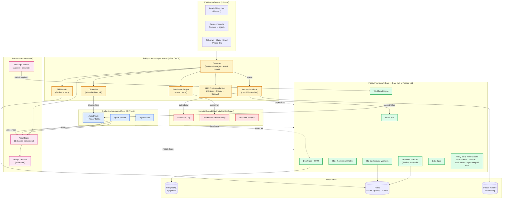
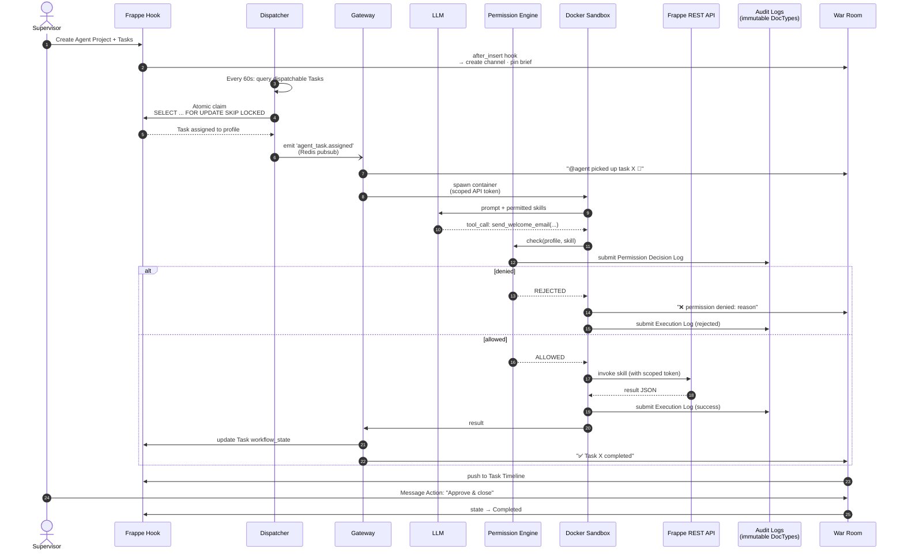

# 14 — Integrated Architecture

> See `00-glossary.md` for term definitions.
> See `39-friday-framework-strategy.md` for fork-not-app identity.
> See `41-porting-strategy-hermes-erpnext-raven.md` for the verdict per Hermes / ERPNext / Raven piece.
> See `42-phase-one-authority-contract.md` for v0.1 scope.
>
> This is the runtime architecture record — how the four layers assemble and how a request flows through them. Module structure is in `05-module-design.md`.

---

## 1. The four layers

| Layer | Source | Role |
|---|---|---|
| **Friday Framework Core** | Hard fork of Frappe v16 stable | DocTypes, permissions, workflows, Socket.io, scheduler, RQ, REST API, bench ecosystem, Framework Console shell, agent-native core primitives |
| **Friday Core (agent kernel)** | New code; Hermes patterns ported, not forked | Agent loop, Gateway, Dispatcher, Permission Engine, Skill Loader, Sandbox runtime, LLM provider adapters |
| **Ported orchestration** | DocTypes ported from `frappe/erpnext` | Agent Project, Agent Task, Agent Issue with Friday-added fields |
| **Raven** | Installed app from `The-Commit-Company/raven` | War Room channels, Message Actions, Timeline integration |

Friday is the framework. The Friday repository **is** the Frappe v16 fork — agent-native primitives are built into core, not bolted on. Upstream Frappe patches are absorbed manually per `45-fork-policy.md`. Domain capability lives in Friday Apps; the agent kernel is part of the fork.

### 1.1 Visual blueprint



**Legend:** 🟨 New code in Friday Core · 🟦 Ported from ERPNext · 🟪 Raven app · 🟩 Frappe v16 fork · 🟥 Immutable audit logs

### 1.2 End-to-end request flow



**Three invariants visible in this flow:**

1. **Permission check happens before execution** (step 11 precedes step 14). No bypass on any path.
2. **Every step writes to audit.** Permission Decision Log and Execution Log are both submittable — immutable once submitted.
3. **War Room reflects every state change.** Operator visibility is on the path, not added later.

---

## 2. Why this composition

Arrived at by elimination, not preference:

- **Chat from scratch:** rejected. Raven exists, is GPL-compatible, integrates with Frappe natively, supports document sharing and Message Actions. Building chat would be reinvention.
- **Project/Task from scratch:** rejected. ERPNext's Project, Task, and Issue are mature with native Kanban, time tracking, dependencies. **Porting** (not depending on ERPNext) keeps Friday self-contained while inheriting that maturity.
- **Hermes backend as-is:** rejected. File-based skills, SQLite sessions, and ad-hoc permissions do not meet enterprise requirements. The agent loop and skill ideas are kept; storage and governance are replaced.
- **Hermes' fixed Kanban lifecycle:** rejected. Business workflows need configurable states. Friday renders Frappe Workflow states as Kanban columns.
- **Custom permission engine:** rejected. Frappe's role-based system is mature and production-hardened. Friday extends it, never replaces it.

Custom engineering effort focuses on the agent kernel — Gateway, Dispatcher, Sandbox, Permission Engine. The rest is reused or ported.

---

## 3. Layer responsibilities

### 3.1 Friday Framework Core (Frappe v16 fork)

Owns:

- DocType schema and ORM.
- Role-based permissions — foundation for the gateway permission gate.
- Workflow engine — used for Agent Task state machine and approval routing.
- Real-time pub/sub — used by Raven, Gateway, and Kanban live updates.
- RQ background workers — used for skill executions, dispatcher tick, curator, learner.
- Scheduler — periodic jobs.
- REST API — used by sandbox containers and external integrations.
- User accounts and authentication — every Agent Profile links to a User.

Friday adds, as core divergences documented in `docs/core-divergences.md`:

- `friday` command group inside bench for agent-specific operations.
- Framework Console as the default workspace.
- Actor and trace context propagation for agent execution.
- Framework-level audit hooks where app hooks are insufficient.
- Agent-aware defaults for jobs, workflows, and execution logs.

Core divergence rule: minimal, documented, and only when an app cannot safely provide the behaviour. Discipline lives in `45-fork-policy.md`.

### 3.2 Raven (communication)

Owns:

- Channels (public and private), direct messages, reactions, file/image sharing.
- Message Actions (right-click → create DocType).
- Document sharing with previews.
- Timeline integration on Frappe documents.

Friday adds:

- One Raven channel per Agent Project (the War Room), auto-created via `after_insert` hook.
- Auto-join of the project's assigned Agent Profiles and supervisors.
- Custom Message Actions: escalate, log decision, approve skill, import skill.
- Standard emoji set indicating agent state (executing, blocked, completed, review).
- Hooks that surface permission denials, skill failures, and escalations as channel messages.

Raven reflects truth. Raven does not own truth — Frappe DocTypes do.

### 3.3 Ported Project / Task / Issue

Owns after porting:

- `Agent Project` (from ERPNext Project) — container for related Agent Tasks.
- `Agent Task` (from ERPNext Task) — unit of work, assignable to an Agent Profile.
- `Agent Issue` (from ERPNext Issue) — blocker, escalation, or bug report.
- Native Kanban and Gantt views.
- Task dependencies and time tracking.

Friday adds to `Agent Task`:

- `assigned_to_profile` link to Agent Profile.
- `required_skills` table.
- `current_execution` link to the active Execution Log.
- `dispatchable` derived flag — true only when the current workflow state is in the dispatchable set.
- Workflow templates tuned for agentic execution.
- Real-time event emission on state changes.

Ported DocTypes live inside the Friday tree and are renamed to avoid clashes if ERPNext is installed alongside. No ERPNext dependency.

### 3.4 Friday Core (agent kernel)

Owns the genuinely new code:

- `Agent Profile`, `Agent Role Profile`, `Skill`, `Skill Draft`, `Skill Version`, `Execution Log` (submittable), `Permission Decision Log` (submittable), `Workflow Request`.
- Gateway orchestrator running on the dedicated `agent_core` RQ worker.
- Dispatcher (scheduled job).
- Permission engine — gates every skill at runtime.
- Skill Loader and Redis cache.
- Docker-based sandbox runtime.
- LLM provider adapters (Minimax first; pluggable).
- Platform message adapters (CLI in Phase 1; Telegram / Discord / Slack in Phase 2).

---

## 4. End-to-end flow (prose form)

Reading the sequence diagram in §1.2 as a narrative for reference:

```
1. Supervisor opens Framework Console.
   Creates an Agent Project ("Customer Onboarding Sprint").
   Adds Agent Tasks tagged with required_skills and target Agent Profiles.

2. Frappe `after_insert` hook fires on Agent Project.
   Friday creates a Raven channel "war-room/customer-onboarding-sprint".
   Linked Users of assigned Agent Profiles are added to the channel.
   The project brief and emoji legend are pinned.

3. Dispatcher (60s scheduled job).
   Queries Agent Task where workflow_state is dispatchable AND assigned_to_profile is null.
   Matches each task to an eligible Agent Profile (required_skills ⊆ permitted_skills).
   Atomically claims: SELECT ... FOR UPDATE SKIP LOCKED.
   Sets workflow_state='Assigned'.
   Emits 'agent_task.assigned' on Redis pub/sub.

4. Gateway (listening on pub/sub).
   Receives the event.
   Posts to the War Room: "@agent picked up task X 🚀".
   Spawns or routes to the agent's Docker container.

5. Agent runs the loop.
   Reads its system prompt and permitted Skills (Redis cache).
   Calls the LLM with Skill definitions.
   LLM emits a tool call (e.g. send_welcome_email(customer_id=...)).

6. Permission engine gates the call before any execution.
   Loads the matrix from Redis (warm path).
   Verifies the agent's role permits the required DocTypes + operations.
   Submits a Permission Decision Log row.
   On allow: proceeds. On deny: rejects with a reason; ❌ posted in War Room.

7. Sandbox executes the skill.
   Container calls the Frappe REST API with a scoped token.
   Target DocType row is created.
   Result returned to the gateway as JSON.

8. Gateway records the outcome.
   Submits an Execution Log row.
   Advances the Agent Task workflow_state (e.g. → Review or → Completed).
   Posts "✅ Task X completed" in War Room with a link to the created document.

9. Raven Timeline integration.
   The message is pushed to the Agent Task's Frappe Timeline.
   The project record carries the conversation as audit history.

10. Supervisor reviews.
    Opens the War Room or Agent Task.
    Right-clicks the agent's "completed" message.
    Uses the Raven Message Action "Approve & close task".
    The Task transitions to workflow_state='Completed'.
```

Every step is permission-checked, audit-logged, and queryable from Frappe.

---

## 5. Data model map

```
User (Frappe)
  ↑ linked_user
Agent Profile (Friday)
  ↓ uses
Agent Role Profile (Friday) ──── grants ────→ Roles (Frappe)
                                              ↓ permit
                                              DocTypes (Frappe + ported)

Agent Project (ported)
  ↓ has many
Agent Task (ported + Friday fields)
  ↓ has many
  • Execution Log (Friday, submittable)
  • Permission Decision Log (Friday, submittable)
  • Workflow Request (Friday)
  • Raven Channel (one per project → War Room)
  • Raven Messages (in that channel)

Skill (Friday, dual storage)
  ↓ referenced by
Agent Task.required_skills (link table)
Agent Profile.permitted_skills (link table)
```

---

## 6. Dual-storage Skills (DocType + file)

Skills exist in two places:

1. **Authoritative for governance:** `Skill` DocType in PostgreSQL — queryable, permission-aware, audit-trailed.
2. **Authoritative for portability and DR:** a file under `{site}/private/files/skills/{skill_name}.json` (or `.yaml`).

Sync rules:

- DocType save → write file (post-commit hook).
- File change detected (manual edit or `git pull`) → flagged for human review in a `Skill Sync Conflict` DocType. **Never auto-imported.**
- Import flow: validate file → create or update DocType via the standard insert path so permissions and hooks fire.

Files are portable; DocTypes are governable; the two back each other up. A corrupted row can be restored from file; a deleted file can be regenerated from the row.

**Open questions (Phase 1, week 3 spike):**

- Hot-path read source — Redis populated from DocType, or Redis populated from file?
- Concurrent edits — Desk edit and `git pull` racing against the same Skill row.
- Conflict-resolution UI for `Skill Sync Conflict`.
- File format — JSON, YAML, or markdown-with-frontmatter (Hermes-style).

These are open. The dual-storage model is decided. The mechanics are not.

---

## 7. Frappe File Manager integration

Friday uses the built-in File DocType for:

- **Skill file storage** under `private/files/skills/` — permission-aware.
- **Execution attachments** — files produced by agents attach to Execution Log rows.
- **Skill import/export bundles** — zip / tar collections for distribution.
- **War Room file sharing** — Raven already wraps Frappe's file system; uploads inherit the same permissions and lifecycle.

No custom file storage layer. File DocType permissions govern every artifact.

---

## 8. Skill import / export pipeline

### Export

1. Supervisor selects Skill rows.
2. Triggers "Export Skills".
3. Friday packages a zip: one JSON/YAML per skill, `manifest.json` (version, author, GPL v3 by default), optional README.
4. Bundle saved to File Manager, downloadable via REST.

### Import

1. Supervisor uploads a bundle (zip or single file).
2. Friday parses the manifest and validates each skill against the JSON schema.
3. Per skill:
   - Name collision → create a `Skill Draft` for review. **Never silent overwrite.**
   - No collision → create as Skill with `status='Experimental'`.
4. Supervisor promotes drafts to Active when satisfied.
5. Audit log records who imported what, when, from where.

Human intervention is mandatory at: conflict resolution, Experimental → Active promotion, and deletion of an Active skill (grace path: Retire → Archive → Delete).

---

## 9. War Room workspace

The War Room is the project's command centre, not just a chat channel.

| Element | Backed by |
|---|---|
| Real-time conversation | Raven channel |
| Active task list | Frappe List View on Agent Task filtered by project |
| Kanban board | Frappe Kanban View on Agent Task |
| Agent status panel | Custom Vue component reading Agent Profile + recent Execution Logs |
| Document feed | Raven document sharing |
| Quick actions | Raven Message Actions + Frappe form actions |
| Pinned project brief | Raven pinned message |
| Audit timeline | Frappe Timeline on Agent Project |

Composition: a Frappe v16 Workspace per Agent Project, pulling the Raven channel embed, Kanban, list view, and custom panels into one screen.

---

## 10. Hermes verdict map

| Hermes piece | Verdict |
|---|---|
| AIAgent loop | ADAPT — keep loop, replace state plumbing |
| Prompt builder | ADAPT — replace file reads with DocType reads |
| Skill markdown system | REWRITE — replaced by Skill DocType + file mirror |
| Kanban dashboard | REWRITE — replaced by Frappe Workflow + Kanban View on Agent Task |
| Platform adapters | ADAPT for CLI (Phase 1); Raven is the human chat surface |
| Cron / scheduler | REWRITE — replaced by Frappe Scheduler |
| Session storage (SQLite + FTS5) | REWRITE — replaced by PostgreSQL + tsvector |
| Approval routing | REWRITE — replaced by Frappe Workflow + Raven Message Actions |
| Memory / vector | REWRITE — replaced by pgvector (Phase 2) |
| Tirith command scanner | REUSE as external dependency (Phase 2) |
| LLM provider abstraction | REUSE pattern, build minimal version Phase 1 |
| Inter-agent dispatching | REWRITE — replaced by Dispatcher querying Agent Task |

Hermes is a reference implementation of agentic ideas, not a codebase to fork. Friday is a fresh implementation on the Frappe + Raven + ported-ERPNext substrate.

The Hermes Kanban lesson — agents propose; humans approve safety-critical structure — is captured in `41-porting-strategy-hermes-erpnext-raven.md`. Validated DocTypes and Frappe Workflow own the operating model.

---

## 11. Phase mapping

This document refines Phase 1 from the integrated-stack perspective. Where it conflicts with `42-phase-one-authority-contract.md`, doc 42 wins.

**Phase 1 (per 42 §3):**

- Friday Framework shell from the Frappe v16 fork.
- bench retained as the operational CLI; `friday` command group added.
- Framework Console as the default workspace.
- Raven installed; War Room from day one if the spike confirms low risk.
- Agent Project, Agent Task, Agent Issue ported from ERPNext into the Friday tree.
- Agent kernel: Agent Profile, Agent Role Profile, Skill (with file mirror), Execution Log, Permission Decision Log, Workflow Request.
- Gateway, Dispatcher, Permission Engine, Docker sandbox at the 42 §5 minimum bar.
- CLI adapter.
- One real skill (`create_note`) end-to-end with War Room status updates.

**Phase 2:**

- Additional platform adapters (Telegram, Slack, etc.).
- Memory module with pgvector queries.
- Skill import/export pipeline.
- Voice, vision, browser automation.
- Tirith integration.

---

## 12. Open engineering questions

These have conceptual agreement but require dedicated design before implementation:

| Question | Why it matters | Where it lands |
|---|---|---|
| Skill DocType ↔ file sync semantics and conflict UI | Dual-storage needs concrete rules | Phase 1, week 3 spike |
| Skill cache hot-path source (file or DocType) | Performance vs governance tradeoff | Phase 1, week 3 spike |
| War Room channel archive / retention policy | Align Raven retention with Frappe lifecycle | Phase 2 |
| Concurrency between Raven message stream and Execution Log writes | Avoid torn audit trails | Phase 1, slice 8 |
| Fine-grained Message Action permissions in Raven | Restrict which user can trigger which action | Phase 2 |
| `Agent Role Profile` schema — inherits Frappe Role Profile or new DocType | Need to test whether Frappe Role Profile suffices | Phase 1, slice 1 spike |
| ERPNext port — which fields to drop, which to keep | Avoid carrying ERP-specific clutter | Phase 1, slice 1 |

These are blockers, not background notes. The implementation agent treats each as a design proposal before proceeding.

---

## 13. Summary

Friday assembles:

- **Friday Framework Core** — Frappe v16 fork: data, permission, workflow, bench, real-time, agent-native primitives.
- **Friday Core (agent kernel)** — Gateway, Dispatcher, Skill Loader, Sandbox, Permission Engine, LLM adapters.
- **Ported Project / Task / Issue** — orchestration scaffolding.
- **Raven** — human-agent and agent-agent collaboration through War Rooms.

This document is the integrated runtime record. Module structure lives in `05-module-design.md`. Product identity lives in `39-friday-framework-strategy.md`. Scope lives in `42-phase-one-authority-contract.md`.
